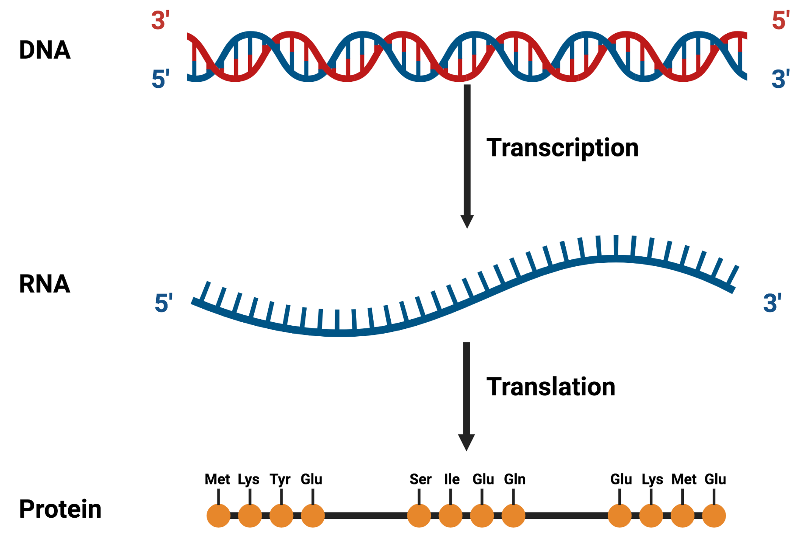
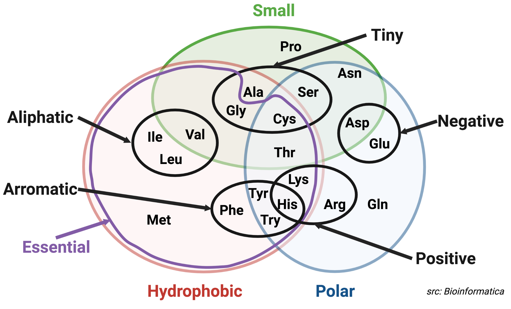
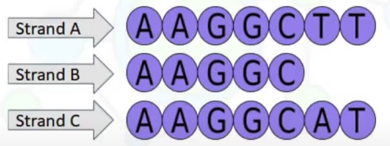

## Definition
### Sequence
* An arrangement of two or more **related things** in a successive order.
* **Related things**:
  * DNA (base pairs as ACTG)
  * RNA (base pairs as ACUG)
  * proteins (amino acids)

### Sequence Alignment
* Arranging the sequences of DNA, RNA, or proteins to identify regions of similarity and identity that may be consequence of functional, structural, or evolutionary relationships.
* Probably the most important and most accomplished in bioinformatics.
* Ultimate goal: determine the similarity between different sequences.

### Sequence Similarity vs. Sequence Indentity
* **DNA & RNA**: sequence similarity and sequence identity are the same.
* **Protein**:
  * Identity: % of exact matches between two aligned sequences.
  * Similarity: % of aligned residues that share similar characteristics.
    ***Similar characteristics:***
    

### Question: 
> In terms of identity distance measure, if sequence A = B and B = C; then, would A be equal to C?

* `Identity(A,B) = 100%` ($\frac{\text{5 identical nucleotides}}{min(length(A), length(B))}$).
* `Identity(B,C) = 100%` ($\frac{\text{5 identical nucleotides}}{min(length(B), length(C))}$).
* `Identity(A,C) = 85%` ($\frac{\text{6 identical nucleotides}}{7}$).
Therefore, 100% identity doesn't mean two sequences are the same.

### Why sequence alignment?
* **Gene finding:** if there is a gene in another organism with a good alignment with the open reading frame (ORF), then the ORF is likely a gene.
* **Function prediction**: two genes are similar determined by sequence alignment, the function of one gene is known, we can assign the same function for the other gene.
* **Genome Sequence Assembly**
* **Indentifying homologous genes:** both identity and similarity are used to deduce homology.

## Algorithms

## Python implementation from scratch

## Implementation with libraries

## References
* [Pairwise Sequence Alignment using Biopython](https://towardsdatascience.com/pairwise-sequence-alignment-using-biopython-d1a9d0ba861f)
* [Local Sequence Alignment & Smith-Waterman Algorithm](https://www.youtube.com/watch?v=lu9ScxSejSE)
* [Global Sequence Alignment & Needleman-Wunsch Algorithm](https://www.youtube.com/watch?v=ipp-pNRIp4g)
* [Sequence similarity and identity](https://www.youtube.com/watch?v=wqsR8qOptto)
* [The concept of homology](https://www.youtube.com/watch?v=d9zprAGoCXY)
